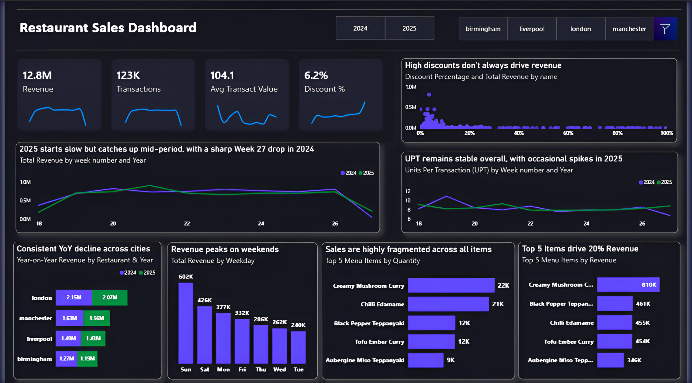

# 📊 Restaurant Sales Dashboard | Power BI

An interactive Power BI dashboard analyzing restaurant sales performance across four UK locations for 2024 and 2025. This project delivers actionable insights on revenue trends, location performance, product contribution, discount effectiveness, and customer purchasing behavior.

## 🔹 Project Overview

The dashboard provides a comprehensive view of restaurant sales operations, enabling data-driven decisions on menu strategy, discount optimization, and operational planning across cities and time periods.

## 🛠 Tools Used

- **Power BI Desktop**
- **Excel** (Data Cleaning & Preparation)
- **DAX** (Data Analysis Expressions)
- **Data Modelling** (Star Schema with 4 tables)

## 📈 Key Insights

- **£12.8M Total Revenue** across 123K transactions with an Average Transaction Value of £104.1
- Consistent **year-over-year revenue decline** across all four cities in 2025
- **London** remains the top contributing location at £2.07M (2025)
- **Weekends drive nearly half of total revenue** — Sunday (£602K) and Saturday (£426K) lead all days
- **Top 5 menu items** collectively contribute 20% of total revenue, led by Creamy Mushroom Curry (£810K)
- **High discounts do not consistently drive higher revenue**, indicating inefficiencies in promotional strategies
- **UPT remains stable** across both years, suggesting growth depends on transaction volume rather than basket size

## 📊 Dashboard Snapshot

## 📁 Files in this Repository

- `Restaurant Sales Dashboard.pbix` - Main Power BI dashboard file
- `RestaurantDataset.xlsx` - Raw dataset
- `dashboard_snapshot.png` - Overview image of the dashboard
- `README.md` - Project documentation

## 🚀 How to Use

1. Download the `.pbix` file and open it in **Power BI Desktop**
2. Ensure `RestaurantDataset.xlsx` is in the same folder as the `.pbix` file
3. Refresh the data to load the latest information
4. Use the filters and slicers to explore insights by city and year

## 📊 Key Metrics & Visualizations

- **Revenue Overview**: Total revenue, transactions, average transaction value, and discount %
- **Weekly Trends**: Year-over-year revenue comparison by week number
- **City Performance**: Stacked bar chart comparing 2024 vs 2025 revenue by location
- **Weekend Analysis**: Revenue breakdown by weekday highlighting peak demand periods
- **Product Performance**: Top 5 menu items by quantity and revenue
- **Discount Analysis**: Relationship between discount percentage and revenue
- **UPT Trends**: Units per transaction tracked over time across both years

## 💡 Business Impact

- Identified consistent year-over-year revenue decline across all locations requiring strategic intervention
- Highlighted weekend demand as the primary revenue driver to guide operational and promotional planning
- Uncovered discount strategy inefficiencies to reduce cost without proportional revenue return
- Enabled data-driven decisions around menu promotion, staffing, and customer acquisition strategies

---
